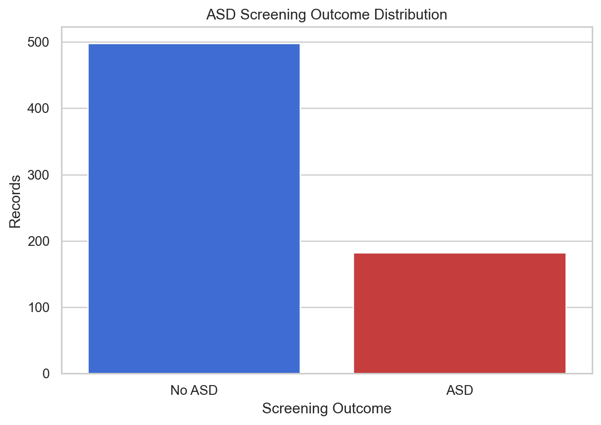
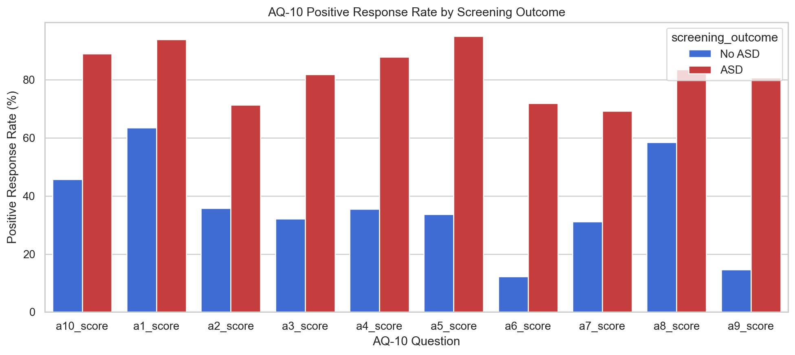
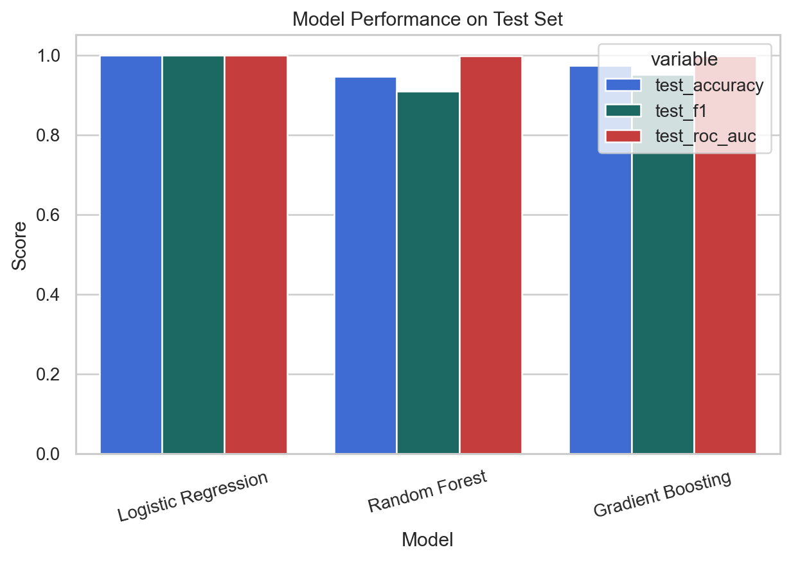
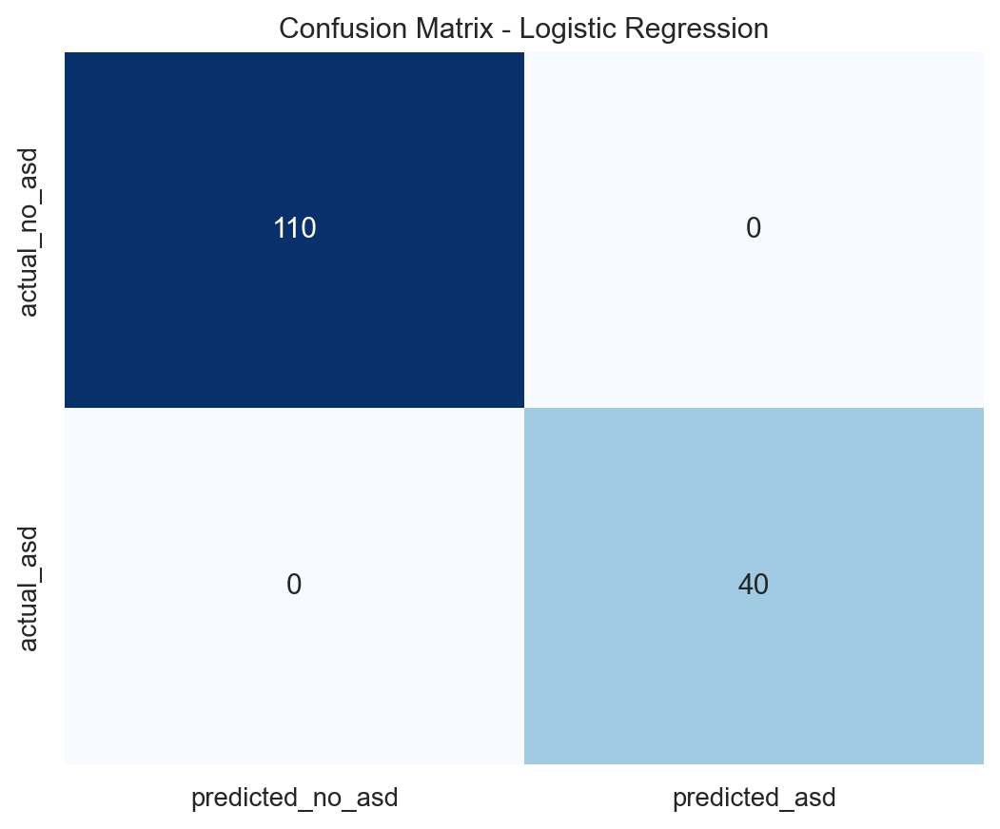
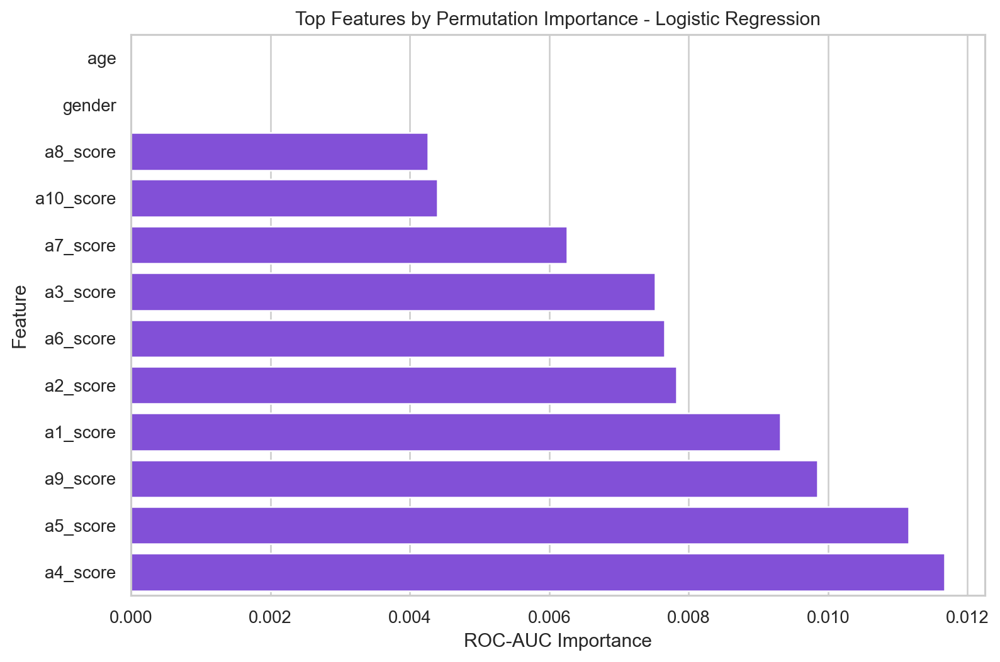

# Autism Spectrum Screening Prediction Using Machine Learning

## Overview

This project analyzes an open UCI autism screening dataset and builds Machine Learning models to predict whether an adult record is likely to receive a positive ASD screening outcome.

The goal is to demonstrate a complete data science workflow: data preparation, exploratory analysis, model training, evaluation, feature interpretation, and reproducible delivery.

> Important: this is a screening and portfolio project, not a medical diagnosis system.
>
> The model scores are very high because the target is questionnaire-derived. These results should be interpreted as a reproducible machine learning workflow, not proof of clinical diagnostic performance.

## Dataset

The project uses the **Autism Screening Adult** dataset from the UCI Machine Learning Repository.

The dataset includes:

- AQ-10 screening question scores
- Age
- Gender
- Ethnicity
- Jaundice history
- Family ASD history
- Country of residence
- Whether the user used a screening app before
- Relationship of the person completing the screening
- ASD screening class

Dataset source details are documented in [data_sources.md](data_sources.md).

## Business Questions

- Can questionnaire and demographic indicators predict ASD screening outcome?
- Which AQ-10 questions are most informative for the model?
- How do model metrics compare across Logistic Regression, Random Forest, and Gradient Boosting?
- What are the most important features affecting screening predictions?
- How can the results be delivered clearly for a portfolio or client demo?

## Work Completed

1. Loaded the original ARFF file from UCI.
2. Decoded categorical values and standardized column names.
3. Cleaned missing values, duplicates, and unrealistic age values.
4. Excluded the aggregate `result` column from model training to reduce leakage risk.
5. Built exploratory charts for target distribution, age, AQ-10 response rates, country summary, and correlations.
6. Trained three classification models:
   - Logistic Regression
   - Random Forest
   - Gradient Boosting
7. Evaluated the models using Accuracy, Precision, Recall, F1, ROC-AUC, and cross-validation.
8. Saved the best model, sample predictions, feature importance, and an Arabic executive report.

## Evaluation Note

The aggregate `result` score was excluded from training to reduce direct leakage. However, the target remains highly related to the AQ-10 question answers, so strong performance is expected. This is useful for demonstrating data preparation, model comparison, and explainability, but it should not be marketed as a validated medical AI product.

## Visual Results

### Target Distribution



### AQ-10 Response Rates



### Model Performance



### Confusion Matrix



### Feature Importance



## Project Files

```text
reports/
  figures/                     # Client-facing visual outputs
  tables/                      # Metrics, sample predictions, feature importance
  executive_report_ar.md       # Arabic executive report
  project_summary.json

scripts/
  build_autism_screening_analysis.py
  predict_autism_screening.py

data_sources.md
MODEL_USAGE.md
requirements.txt
```

The `data/raw`, `data/processed`, and `models` folders are generated locally when the pipeline is run. They are intentionally excluded from this public repository.

## How to Run

Install dependencies:

```bash
pip install -r requirements.txt
```

Run the full pipeline:

```bash
python scripts/build_autism_screening_analysis.py
```

Run a sample prediction:

```bash
python scripts/predict_autism_screening.py
```

## Tools Used

- Python
- Pandas
- SciPy
- Matplotlib
- Seaborn
- Scikit-learn
- Joblib

## Deliverables

- Cleaned autism screening dataset generated locally when the pipeline is run
- Exploratory analysis charts
- Classification model comparison
- Saved best model generated locally, not published in the public repository
- Sample prediction output
- Feature importance report
- Confusion matrix and model metrics
- Arabic executive report
- Reproducible Python pipeline

## Public Version Boundary

This public repository excludes raw data files, processed datasets, and trained model artifacts. It keeps the client-facing analysis outputs and documentation.
